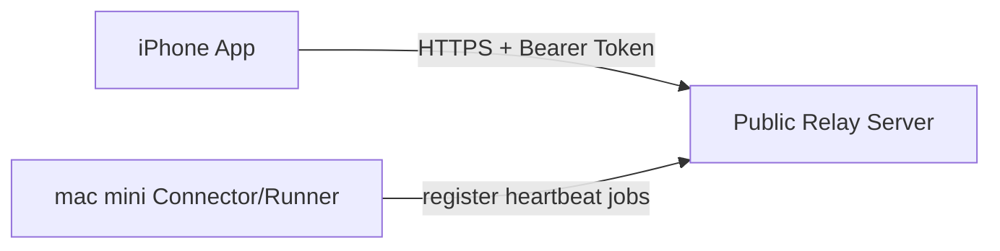

# iOS App Guide: 从 0 到可用（含电脑端 + 服务器部署）

本指南面向第一次部署的用户，目标是让 iPhone 能稳定连上你自己的 Relay 系统。

## 前提条件（必须满足）

这不是托管 SaaS，想用本 App，必须具备以下两项：

1. 你需要自行搭建一台可公网访问的 Relay 服务器（建议 HTTPS 域名）。
2. 你需要有一台可登录 Codex 的桌面/Mac 设备，并且保持 connector/runner 实时运行（常驻在线）。

如果缺少任一项，iOS App 无法完成完整链路（状态、线程、消息和任务执行）。

## 你要准备什么

| 角色 | 必需 | 说明 |
| --- | --- | --- |
| 服务器 | Ubuntu 22.04 + 公网域名 | 提供 Relay API（HTTPS） |
| 电脑端 | mac mini (macOS 14+) | 跑 connector/runner，执行任务 |
| 手机端 | iPhone + 本 App | 连接 Relay，查看状态和发消息 |

## 最短路径（推荐顺序）

1. 先部署服务器（拿到可访问的 `https://your-domain`）。
2. 再部署 mac mini（让 connector/runner 连上同一个 Relay）。
3. 最后打开 iOS App，填 `Base URL + Token`。
4. 跑一次端到端验收。

## 架构一图看懂



## Step 1: 部署服务器（Ubuntu 22.04）

在仓库根目录执行：

```bash
INSTALL_DIR=/opt/codex_relay_mobile RUN_USER=codexrelay ./deploy/server/install_ubuntu22.sh
RELAY_DOMAIN=relay.example.com CERTBOT_EMAIL=ops@example.com ./deploy/server/configure_nginx_tls.sh
RELAY_DOMAIN=relay.example.com ./deploy/server/doctor.sh
```

成功标准：
- `doctor` 输出 `doctor passed`
- 能访问 `https://relay.example.com/healthz`

你需要记下两项给 iOS 和 mac mini：
- `RELAY_BASE_URL`（例如 `https://relay.example.com`）
- `RELAY_TOKEN`

## Step 2: 部署电脑端（mac mini）

在仓库根目录执行：

```bash
./deploy/macmini/install.sh
./deploy/macmini/init-env.sh
./deploy/macmini/bootstrap.sh
./deploy/macmini/doctor.sh
```

`init-env.sh` 里重点填：
- `RELAY_BASE_URL`：填 Step 1 的域名
- `RELAY_TOKEN`：填 Step 1 的 token
- `SERVICE_LABEL_PREFIX`：建议保留默认 `com.yourorg.codexrelay`

成功标准：
- `doctor` 输出 `doctor passed`
- `npm run connector:status` 显示在线
- `npm run runner:status` 显示在线

## Step 3: 配置 iOS App

App 首次启动进入 `Relay Setup`，填写：
- `Base URL`: `https://relay.example.com`
- `Bearer Token`: 与服务器一致
- `Workspace`: 推荐 `*`（或固定 `default`）

点击 `Save and Start`。

可选：在 Mac/云端生成配置二维码，手机相机扫码后自动回填：

```bash
npm run relay:setup:qr
```

默认输出：`state/relay_setup/relay_setup_qr.png`。  
注意：二维码包含明文 token，请按密钥处理（不要外传、截图后及时删除）。

成功标准：
- `Status` 页里 `connector_online = ONLINE`
- `runner_online = ONLINE`

## Step 4: 端到端验收（必须做）

1. 在 `Threads` 新建线程。
2. 发一条测试消息（例如：`hello from iphone e2e`）。
3. 确认能收到回复/事件流。

再做一个故障切换测试：

```bash
# 在 mac mini 上
npm run connector:stop
# iOS Status 应看到 connector_offline
npm run connector:start
# iOS Status 应恢复 online
```

## 实机部署测试（Xcode + TestFlight）

### A. Xcode 直连真机（开发阶段）

1. iPhone 连接 Mac，信任设备。
2. Xcode 打开 `ios/CodexIPhone.xcodeproj`，Scheme 选 `CodexIPhoneApp`。
3. Signing 选择你的 Team（当前默认 Team: `G836GGPF7C`）。
4. 选择真机目标，点击 Run 安装 App。
5. 在手机里按 Step 3 填 `Base URL + Token`，再执行 Step 4 验收流程。

### B. TestFlight（发布前回归）

1. 打包上传到 TestFlight 后，邀请内部测试用户。
2. 测试用户安装 TestFlight 版本，重新填写 `Base URL + Token`。
3. 逐项验证：
   - Status 在线状态（relay/connector/runner）
   - 创建线程与消息往返
   - 断连恢复（停 connector 再启动）
4. 记录是否出现 UI 空白、配置丢失、鉴权失败等问题。

## 常见问题（按症状）

### 1) iOS 一直连不上
- 检查 `Base URL` 是否是 `https://` 完整地址
- 检查 token 是否和服务器 `config/.env` 一致
- 服务器执行：
```bash
RELAY_DOMAIN=relay.example.com ./deploy/server/doctor.sh
```

### 2) iOS 显示 relay 在线但没有任务执行
- 多半是 mac mini 侧 connector/runner 未在线
- 执行：
```bash
npm run connector:status
npm run runner:status
./deploy/macmini/doctor.sh
```

### 3) 重启后服务不自动拉起
- 重新安装 launchd：
```bash
npm run runner:uninstall-launchd && npm run runner:install-launchd
npm run connector:uninstall-launchd && npm run connector:install-launchd
```

## 运维建议

- 生产只暴露 `443`（`8787` 保持本机回环）。
- 定期轮换 `RELAY_TOKEN`。
- 每次升级后至少执行一次 Step 4 端到端验收。

## 一键入口（同一个脚本）

你可以用同一个入口脚本部署：

```bash
# 自动识别系统：macOS 走 macmini，Linux 走 server
./deploy/oneclick.sh auto

# 或指定
./deploy/oneclick.sh macmini
RELAY_DOMAIN=relay.example.com CERTBOT_EMAIL=ops@example.com ./deploy/oneclick.sh server
```

## 不影响现网的测试方案（推荐）

使用“并行 staging 环境”，不覆盖你当前生产配置：

- 服务器：独立目录、独立服务名、独立端口（例如 `8794`）、独立 token
- mac：独立 `SERVICE_LABEL_PREFIX`（例如 `com.yourorg.codexrelay.staging`）和独立 `STATE_DIR`
- iOS：创建单独 profile，连接 staging URL + staging token

快速命令：

```bash
# 在 mac mini 上创建并启动隔离 staging 服务
npm run deploy:smoke:macmini

# 在 Linux 服务器上创建隔离 staging relay 服务
npm run deploy:smoke:server

# 测完后回收（不影响生产）
npm run deploy:smoke:teardown:macmini
npm run deploy:smoke:teardown:server
```

详见：`docs/testing/nonprod-isolated-testing.md`

## 相关文档
- GitHub 仓库：`https://github.com/your-org/codex-relay-mobile-release`
- GitHub Release：`https://github.com/your-org/codex-relay-mobile-release/releases/latest`
- 网页版详细指南：`https://docs.example.com/codex-relay-mobile/`
- 服务器详版：`docs/deploy/server-ubuntu22.md`
- mac mini 详版：`docs/deploy/macmini.md`
- 上架清单：`docs/appstore/release-checklist.md`
- 网页版 guide 源码：`docs/site/guide.html`
